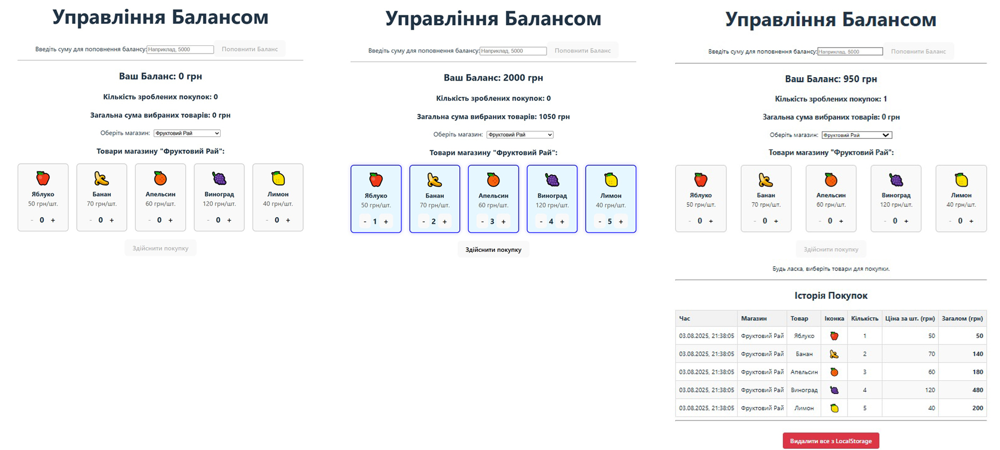

# Програма управління балансом

Реалізовано:

- 1 Поповнення балансу.
- 2 Можливість здійснювати покупки в 3 магазинах (Фруктовий рай, Овочева грядка, Бакалія).
- 3 Перегляд суми кожної покупки та історії всіх покупок.
- 4 Запис у локальне сховище баланса та історії покупок та видалення.

## Стек технологій:

React + TypeScript
fgfgfgf
